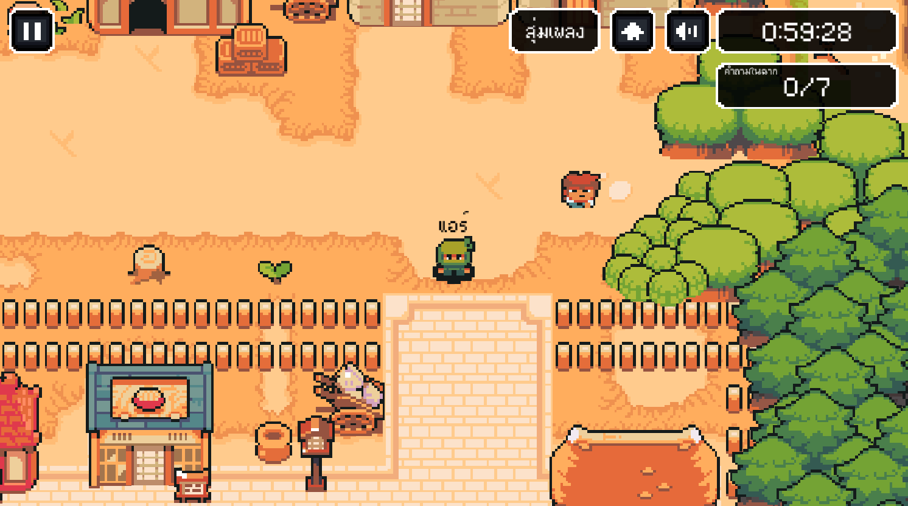
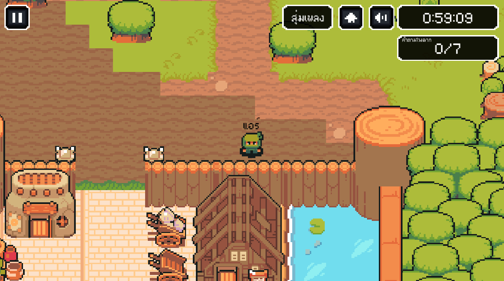
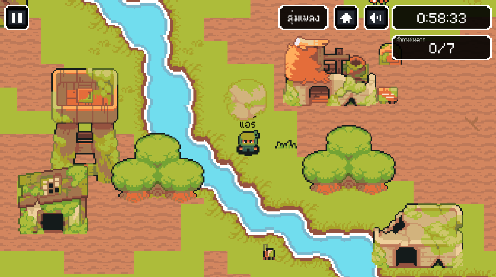

# เกม 2D ผจญภัยแก้ปริศนาเชาวน์

เกมนี้พัฒนาด้วย Unity สำหรับใช้เป็นผลงานนำเสนอ (KOSIN KANIN) โดยเปิดให้ทดลองเล่นบนระบบปฏิบัติการ Windows

## ดาวน์โหลดเกม

ดาวน์โหลดไฟล์เกมได้ที่ลิงก์ด้านล่าง (ไฟล์ .zip):

[ดาวน์โหลดเกมสำหรับ Windows (.zip)](https://drive.google.com/file/d/1zmZSpgnF0dpYoF-NgU4YgGjuHesLdnVe/view?usp=sharing)

## วิธีการติดตั้งและเปิดเกม

1. ดาวน์โหลดไฟล์ .zip จากลิงก์ด้านบน
2. คลิกขวาที่ไฟล์ และเลือก “Extract All...” หรือ “แตกไฟล์ทั้งหมด”
3. เมื่อแตกไฟล์เสร็จ จะได้โฟลเดอร์ใหม่
4. เปิดโฟลเดอร์นั้น และดับเบิลคลิกไฟล์ที่ชื่อว่า `2D ผจญภัยแก้ปริศนาเชาวน์.exe` เพื่อเริ่มเล่นเกม

**หมายเหตุ:**  
หากระบบ Windows แสดงข้อความเตือนว่าไฟล์ไม่ปลอดภัย หรือไม่รู้จักแหล่งที่มา ให้คลิก “เพิ่มเติม (More info)” และเลือก “เรียกใช้งานอยู่ดี (Run anyway)” ซึ่งเป็นพฤติกรรมปกติสำหรับเกมที่ยังไม่ได้เซ็นรับรองแบบดิจิทัล

## เกี่ยวกับโปรเจกต์

- พัฒนาโดยใช้ Unity
- เขียนโปรแกรมด้วยภาษา C#
- รองรับเฉพาะ Windows
- โค้ดของเกมนี้ไม่ได้เปิดเผยต่อสาธารณะ

## เครดิต

- **Pixel Art Assets** จาก [Ninja Adventure Asset Pack โดย PixelBoy](https://pixel-boy.itch.io/ninja-adventure-asset-pack)

## ติดต่อ

หากต้องการสอบถามข้อมูลเพิ่มเติมเกี่ยวกับโปรเจกต์นี้ กรุณาติดต่อได้ที่:

อีเมล: Kosinair@gmail.com

## ตัวอย่างภาพจากเกม

